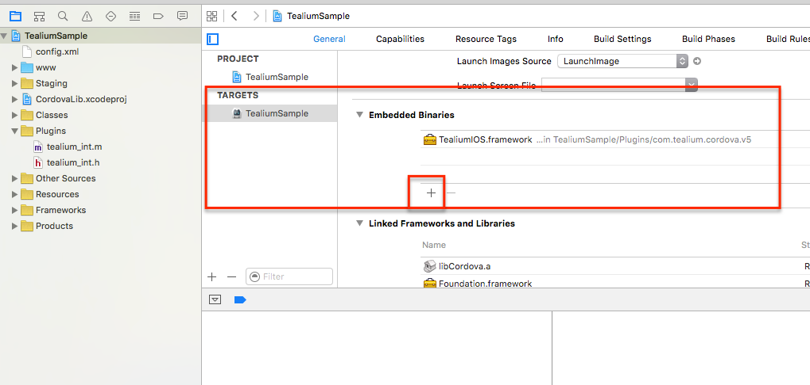

Cordova Plugin 1.0.1
====================
## Brief

This plugin provides the means to tag Cordova built applications for the purposes of leveraging [Tealium's tag management platform (Tealium IQ)](http://tealium.com/products/enterprise-tag-management/), which permit [Tealium-enabled mobile apps](http://tealium.com/products/enterprise-tag-management/mobile/) to add, remove or edit analytic services remotely, in real-time, without requiring a code rebuild or new release to take effect.

### Table of Contents ###

- [Requirements](#requirements)
- [Embedded Tealium Libraries](#embedded-tealium-libraries)
- [Upgrade Notice](#upgrade-notice)
- [Add Plugin](#add-plugin)
- [Add Tracking](#add-tracking)
- [Removing Tealium (optional)](#removing-tealium-optional)
- [Troubleshooting](#troubleshooting)
- [Known Issues](#known-issues)
- [Change Log](#change-log)

## Requirements

* Cordova 5.1.1+

## Embedded Tealium Libraries

* [Tealium iOS 5.0.3](https://www.github.com/Tealium/tealium-ios) including lifecycle module (TealiumIOSLifecycle.framework)
* [Tealium Android 5.0.2](https://www.github.com/Tealium/tealium-android) including lifecycle module (tealium.lifecycle-5.0.0.aar)

## Upgrade Notice

If upgrading from the previous Cordova Tealium plugin (pre 0.9.6), first issue the following commands:

```cordova plugin rm com.tealium.cordova.compact```

```cordova plugin add ../Tealium```

This assumes that you are in the root directory for your app, and the Tealium plugin is located 1 level up the directory tree in a directory called "Tealium". If this is not the case, modify the commands accordingly.

## Add Plugin
From the Command-Line Interface (CLI), first:

1. ```cordova create </PATH_TO_PROJECT>```
2. ```cd in to project```
3. ```cordova platform add <PLATFORM>```
4. ```cordova plugin add </LOCAL_PATH_TO_TEALIUM_PLUGIN/>```
5. ```cordova build <PLATFORM>```

Then init the library in your project:

```javascript
tealium.init({
account : "tealiummobile" 		// CHANGE REQUIRED: Your account.
, profile : "demo" 				// CHANGE REQUIRED: Profile you wish to use.
, environment : "dev" 			// CHANGE REQUIRED: Desired target environment - "dev", "qa", or "prod".
, instance : "tealium"          // CHANGE OPITONAL: This is the instance name you will use to refer to your tracker once created.
, isLifecycleEnabled : "true" // CHANGE OPTIONAL: If you wish to disable lifecycle tracking (launch, wake, sleep), set this value to STRING false (not boolean false)
});
```
Please note: Lifecycle tracking is enabled by default if you do not pass any value for isLifecycleEnabled. You must pass the string value "false" to disable lifecycle tracking.
### Add Tracking
The following is an example of how to track events or view changes:

```javascript
tealium.track("view", // "view" or "link"
{ "custom_key" : "custom_val" }, // Object containing key-value pairs.
"tealium" // Replace this with your instance ID
);
```

Note: As a rule of thumb, "view" should be used whenever a screen view takes place, while "link" is used to track user interaction events, such as button clicks. These methods correspond directly to "utag.view" and "utag.link" in Tealium IQ desktop implementations.

#### The "instance" Argument
In the previous version of the plugin, only a single instance of Tealium was supported. In the new version, multiple instances of Tealium can be created. The new plugin therefore requires an instance ID to be passed at initialization time, and with each subsequent tracking request. If you are upgrading, you will therefore need to modify your code to specify a tracking instance. If you only require a single instance, it is recommended to create a global variable to store your instance ID, and pass this variable on each tracking call. An example of this is shown in the sample app.

## Building The Sample App

- Navigate into the sample app root directory (should be "TealiumSample")
- Run command ```cordova platform add ios```
- Run command ```cordova platform add android```
- Run command ```cordova build ios```
- Run command ```cordova build android```
- The sample app will be built with the Tealium plugin included. Build outputs can be found in the TealiumSample/platforms/\<platform\>/build

## Removing Tealium (Optional)
In the CLI, in your Cordova project folder run:
```
cordova plugin rm com.tealium.cordova.v5
```

## Troubleshooting
Once the app is compiled, you can use the Safari Developer Tools for iOS and the Chrome Developer Tools for Android to remotely inspect the Tealium web view.

For Chrome/Android, go to "chrome://inspect" and look for "mobile.html".
For Safari/iOS, go to Develop \-\> \<Your Device Name\> \-\> "mobile.html".

All network requests generated by the Tealium plugin will appear in the "Network" tab of the developer tools for each browser.

Please note that you must connect your device with a USB cable to use this feature. 

Any errors logged during Tealium initialization will be stored on the global variable window.tealium\_cordova\_error. If Tealium init fails, check this variable in the JavaScript console (via Chrome or Safari) for error messages. Errors are stored here, because it is not always possible to inspect the app in time before the init occurs, so this method allows for later access to the error message.

### Gotchas
- iOS: After adding the plugin to your cordova project, you must load your app's ".xcodeproj" file in XCode and add "TealiumIOS.framework" and "TealiumIOSLifecycle.framework" in your project settings as an Embedded Binary. Unfortunately, Cordova does not provide a method to automate this via the plugin.xml file. You can find "Embedded Binaries" under Project settings > General > Targets (Your App Name) > Embedded Binaries. Simply click the "+" button and select TealiumIOS.framework and TealiumIOSLifecycle.framework from the list. Screenshot:



- If you have any issues building your app, you may need to remove and re-add the platform using the following Cordova command:

```cordova platform rm <platform>```

```cordova platform add <platform>```

Substitute "platform" for either "android" or ios as appropriate.

## Known Issues
- Lifecycle tracking: Android => Lifecycle tracking (launch, wake, sleep) is currently inconsistent on Android. Often, wake events are counted as launch events, which may skew tracking. We are working on a fix for the next release, but for now, we recommend disabling lifecycle tracking.
- Lifecycle tracking: iOS => Launch event is currently not tracked, but wake and sleep events are tracked successfully. At this time, we recommend disabling lifecycle tracking for this reason. We hope to have this fixed for the next release.

## Roadmap
- Planning to add support for setting persistent data sources in a future release. Currently, only volatile data sources are supported, and must be sent with each tracking call.
- Improved support for the [Tealium AudienceStream](http://tealium.com/products/audiencestream/) Customer Data Platform (add option to change settings and retrieve data)
- Windows Phone support to be investigated/added (no timeline as yet). Will include lib https://github.com/Tealium/win-library

## Change Log
- 1.0.1 Upgraded core libraries to Android 5.0.2 and iOS 5.0.3 respectively
- 1.0.1 Added lifecycle tracking by default to Android and iOS & additional config option to disable lifecycle tracking
- 1.0.1 Added option to override the init successCallback function (see pull request https://github.com/Tealium/cordova-plugin/pull/8/commits/70ca605393119bac36a7ba66f2ec205a52edf324)
- 0.9.6 Multiton pattern now fully supported (allows multiple instances of IQ to run in the same app)
- 0.9.6 Upgraded to use new Tealium core libraries for Android and iOS (v5.0.0 and 5.0.1 respectively)
- 0.9.4 Fixed Typo in config.xml
- 0.9.2 Update to Plugin.xml
- 0.9.0 Update of older phonegap-plugin to Cordova 5.1.1


------------------------------------------------------

Copyright (C) 2012-2016, Tealium Inc.
